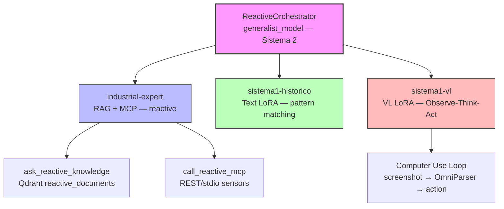
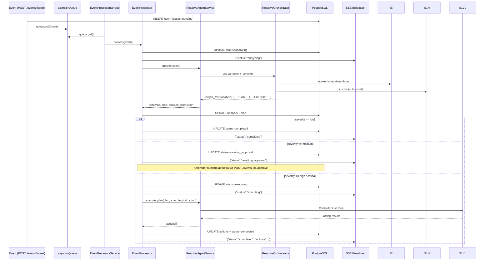

# Analisis de Dominio: Arquitectura de Agentes y Subagentes del Sistema Reactivo

## Resumen Ejecutivo

El sistema reactivo implementa un pipeline de procesamiento de eventos industriales (alarmas, anomalias, fallas) orquestado por un **ReactiveOrchestrator** de dos niveles que delega en tres subagentes especializados: `industrial-expert` (datos en tiempo real + RAG), `sistema1-historico` (patrones historicos fine-tuned) y `sistema1-vl` (ejecucion autonoma GUI via Observe-Think-Act). A diferencia del dominio proactivo (chat conversacional con usuario), el reactivo es **event-driven**, sin streaming de UI, y retorna un formato estructurado de tres secciones (`Analisis`, `---PLAN---`, `---EXECUTE---`). La separacion de dominios es limpia a nivel de orquestador, pero presenta **duplicacion de factories, prompts casi identicos y flags de configuracion paralelos** que constituyen deuda tecnica moderada.

---

## 1. Catalogo de Archivos del Dominio Reactivo (Agentes)

| Archivo | Rol | Lineas (aprox) |
|---------|-----|----------------|
| `app/domain/reactiva/agent/reactive_orchestrator.py` | Factory del orquestador top-level (generalista) | 105 |
| `app/domain/reactiva/agent/reactive_factory.py` | Factory del subagente `industrial-expert` reactivo | 73 |
| `app/domain/reactiva/agent/reactive_service.py` | Servicio de alto nivel: `analyze()` y `execute_plan()` | 329 |
| `app/domain/reactiva/agent/subagents/reactive_system1.py` | Wrappers reactivos de Sistema 1 (historico + VL) | 124 |
| `app/domain/reactiva/agent/prompts/reactive_orchestrator.py` | Prompt template + builder del orquestador reactivo | 235 |
| `app/domain/reactiva/agent/prompts/reactive_industrial.py` | Prompt del subagente industrial reactivo | 124 |
| `app/domain/reactiva/agent/prompts/reactive_system1_historico.py` | Prompt fine-tuned para diagnostico historico de eventos | 98 |
| `app/domain/reactiva/agent/tools/reactive_mcp_tool.py` | Tool MCP con filtrado `key_values`/`key_figures` | 168 |
| `app/domain/reactiva/agent/tools/reactive_knowledge_tool.py` | Tool RAG para SOPs y procedimientos de emergencia | 83 |
| `app/domain/reactiva/events/processor.py` | State machine del evento: analiza → planifica → ejecuta | 124 |
| `app/domain/reactiva/events/event_service.py` | Worker asyncio.Queue que consume eventos | 52 |
| `app/domain/reactiva/schemas/event.py` | SQLModel `Event` (PostgreSQL) | 65 |

**Infraestructura compartida** (`domain/shared/`):
- `app/domain/shared/agent/subagents/system1.py` — constructores base de Sistema 1 (Text + VL LoRA)
- `app/domain/shared/agent/memory_backends.py` — `CompositeBackend` (StateBackend + UserScopedStoreBackend)
- `app/domain/shared/services/mcp_service.py` — servicio MCP REST/stdio compartido

---

## 2. Jerarquia de Agentes / Subagentes (Reactivo)



### Descripcion de Responsabilidades

- **ReactiveOrchestrator**: Recibe el evento como mensaje `HumanMessage`, clasifica severidad/blast-radius, decide que subagentes invocar, sintetiza diagnostico, genera plan de remediacion y (solo si `sistema1-vl` esta disponible) emite una seccion `---EXECUTE---`.
- **industrial-expert**: Extrae datos de sensores actuales (MCP) y busca SOPs/procedimientos (RAG). Devuelve **JSON envelope estricto** (`task_status`, `mcp_data`, `rag_data`).
- **sistema1-historico**: Correlaciona el evento con patrones de falla pasados embebidos en los pesos fine-tuned. **Zero tools**.
- **sistema1-vl**: Ejecuta acciones GUI autonomas (SCADA HMI, SAP/ERP, email) mediante loop Observe-Think-Act. Solo se activa si `reactive_computer_use_enabled=True` y severidad es high/critical.

---

## 3. Flujo End-to-End de un Evento (Diagrama de Secuencia)



---

## 4. Comparativa: Dominio Proactivo vs Reactivo

### 4.1 Jerarquia de Agentes

| Aspecto | Proactivo (Chat) | Reactivo (Eventos) |
|---------|------------------|--------------------|
| **Entry point** | `AgentService.invoke/stream()` | `EventProcessor.process()` |
| **Orchestrator** | `GeneralistOrchestrator` | `ReactiveOrchestrator` |
| **Subagentes** | `industrial-expert`, `sistema1-historico`, `sistema1-vl` + satelites (SAP, Google, Office) | `industrial-expert`, `sistema1-historico`, `sistema1-vl` (sin satelites) |
| **Output** | Respuesta conversacional libre | Estructurado: Analisis + `---PLAN---` + `---EXECUTE---` |
| **Streaming** | Si (`astream_events` v2 → UI) | No (batch, retorna tupla) |
| **Contexto** | `user_id`, `thread_id` | `tenant_id`, `event.id` |

### 4.2 Factories y Prompts

| Componente | Proactivo | Reactivo | Diferencia Clave |
|------------|-----------|----------|------------------|
| **Factory industrial** | `create_industrial_agent()` en `proactiva/agent/factory.py` | `create_reactive_industrial_agent()` en `reactiva/agent/reactive_factory.py` | Nombres y paths distintos; logica **casi identica** (misma firma de tools, mismo `create_deep_agent`) |
| **Prompt industrial** | `INDUSTRIAL_SYSTEM_PROMPT` (`industrial.py`) | `REACTIVE_INDUSTRIAL_PROMPT` (`reactive_industrial.py`) | ~90% identicos. Diferencia principal: contexto de "evento industrial" vs "consulta de usuario" y reglas de filtrado MCP orientadas a equipo afectado |
| **Prompt orquestador** | `GENERALIST_SYSTEM_PROMPT` (`generalist.py`) | `_REACTIVE_PROMPT_TEMPLATE` (`reactive_orchestrator.py`) | Proactivo: Director/Synthesizer. Reactivo: Director/Commander con seccion `---EXECUTE---` condicional |
| **Prompt S1 historico** | `SISTEMA1_HISTORICO_PROMPT` | `REACTIVE_SISTEMA1_HISTORICO_PROMPT` | Reactivo incluye workflow de diagnostico de eventos, ejemplos de alarmas/calderas/bombas, y scope out explicito |

### 4.3 Tools y Repositorios

| Tool | Proactivo | Reactivo |
|------|-----------|----------|
| MCP | `call_dynamic_mcp` (tabla `ToolConfig`, user-scoped) | `call_reactive_mcp` (tabla `ReactiveToolConfig`, tenant-scoped) |
| RAG | `ask_knowledge_agent` (coleccion proactiva) | `ask_reactive_knowledge` (coleccion `reactive_documents`) |
| Repositorio MCP | `ToolConfigRepository` | `ReactiveToolConfigRepository` |
| Repositorio Eventos | — | `EventRepository` |

### 4.4 Infraestructura Compartida (Bien Aislada)

- **`domain.shared.agent.subagents.system1`**: `create_system1_historico_agent()` y `create_system1_vl_agent()` son invocados por **ambos** dominios. Correcto.
- **`domain.shared.agent.memory_backends`**: `create_composite_backend` usado por ambos orquestadores. Correcto.
- **`domain.shared.services.mcp_service`**: `MCPService.execute_tool()` es el motor comun; las tools reactiva/proactiva solo differen en URL resolution y scoping. Correcto.

---

## 5. Deuda Tecnica e Inconsistencias Identificadas

### Hallazgos Priorizados

| ID | Hallazgo | Severidad | Categoria | Archivos Afectados |
|----|----------|-----------|-----------|-------------------|
| **R1** | **Duplicacion de factories industriales**: `create_industrial_agent` y `create_reactive_industrial_agent` tienen logica casi identica (~50 lineas duplicadas). Solo differen en prompt importado y nombre. | **Media** | Duplicacion | `proactiva/agent/factory.py`, `reactiva/agent/reactive_factory.py` |
| **R2** | **Duplicacion de prompts industriales**: `INDUSTRIAL_SYSTEM_PROMPT` y `REACTIVE_INDUSTRIAL_PROMPT` comparten ~90% del texto (estructura JSON envelope, reglas MCP, reglas RAG). | **Media** | Duplicacion | `proactiva/agent/prompts/industrial.py`, `reactiva/agent/prompts/reactive_industrial.py` |
| **R3** | **Flags de Computer Use paralelos**: `settings.computer_use_enabled` (proactivo) y `settings.reactive_computer_use_enabled` (reactivo). Ambos controlan la misma capacidad (VL LoRA + Computer Use) en dominios distintos. Riesgo de desincronizacion operativa. | **Alta** | Inconsistencia / Configuracion | `app/core/config.py`, `proactiva/agent/orchestrator.py`, `reactiva/agent/reactive_orchestrator.py` |
| **R4** | **Cache del grafo reactivo deshabilitado**: `_REACTIVE_GRAPH_CACHE` tiene la logica comentada (`# if cache_key in _REACTIVE_GRAPH_CACHE`). Esto fuerza re-construccion del grafo en CADA evento, incrementando latencia y carga en vLLM. | **Alta** | Performance | `reactiva/agent/reactive_service.py` |
| **R5** | **Leaky session en config de LangGraph**: `session` se pasa dentro de `config["configurable"]` al grafo LangGraph. Si el grafo retiene referencias entre chunks, puede cerrar sesiones async inesperadamente o causar leaks. | **Media** | Arquitectura / Seguridad | `reactiva/agent/reactive_service.py` |
| **R6** | **Parser fragil de secciones**: El parsing de `---PLAN---` y `---EXECUTE---` usa `partition()` string simple. Si el LLM genera markdown headers con esos strings en contenido legitimo, se produce corte incorrecto. | **Media** | Robustez | `reactiva/agent/reactive_service.py` |
| **R7** | **Orquestador proactivo tiene `worker_model`; reactivo no**: El orquestador proactivo acepta `worker_model` para el industrial-expert; el reactivo no expone este parametro, limitando flexibilidad de routing de modelos. | **Baja** | Inconsistencia API | `proactiva/agent/orchestrator.py`, `reactiva/agent/reactive_orchestrator.py` |
| **R8** | **No hay replay buffer VL en reactivo**: `reactive_orchestrator.py` pasa `vl_replay_buffer=None` forzosamente. El dominio proactivo puede almacenar trajectorias de entrenamiento (`vl_replay_buffer`). | **Baja** | Capacidad / ML | `reactiva/agent/reactive_orchestrator.py` |
| **R9** | **Missing subagentes satelites en reactivo**: SAP, Google, Office agents existen en proactivo pero no estan disponibles en reactivo. Si un evento requiere enviar un email via Gmail API (no browser), no hay agente dedicado. | **Baja** | Funcionalidad | `proactiva/agent/subagents/__init__.py` |
| **R10** | **Temperatura del VL model fija a 1.0**: El reactivo fuerza `temperature=1.0` (recomendado por Google para Gemma 4) pero no permite override via configuracion. | **Baja** | Configuracion | `reactiva/agent/reactive_service.py` |

### Analisis Detallado de Hallazgos Criticos

#### R3 — Flags Computer Use Duplicados

```python
# app/core/config.py (lineas 58, 86)
computer_use_enabled: bool = False          # Proactivo
reactive_computer_use_enabled: bool = False   # Reactivo
```

**Riesgo**: Un operador puede habilitar computer-use para chat (proactivo) pero olvidar el flag reactivo, dejando el sistema sin capacidad de auto-remediacion en eventos criticos. Alternativamente, habilitar solo el reactivo sin entender que comparten el mismo VL LoRA y backend de screenshots.

**Recomendacion**: Consolidar en un unico flag `computer_use_enabled` con una sub-configuracion `auto_execute_on_severity` para el dominio reactivo, o al menos documentar la interdependencia en `config.py`.

#### R4 — Cache Deshabilitado en Reactivo

```python
# app/domain/reactiva/agent/reactive_service.py:51-57
async def _get_or_create_graph(self, tenant_id: str, session):
    cache_key = f"reactive_orchestrator_{tenant_id}"
    # Disable cache temporarily to ensure clean tool reloading
    # if cache_key in _REACTIVE_GRAPH_CACHE:
    #     return _REACTIVE_GRAPH_CACHE[cache_key]["agent"]
```

**Impacto**: Cada evento reconstruye el grafo LangGraph completo, incluyendo la instanciacion de subagentes y la compilacion de prompts. En un entorno con decenas de eventos por minuto, esto genera latencia adicional de 200-500ms por evento y carga innecesaria en CPU/memoria.

**Recomendacion**: Rehabilitar el cache con invalidacion selectiva cuando cambie `mcp_tools_context` o los modelos subyacentes. El proactivo ya implementa esto con `_cache_lock` y hash de `tools_context`.

#### R5 — Session en Configurable de LangGraph

```python
# app/domain/reactiva/agent/reactive_service.py:169-175
config = {
    "configurable": {
        "thread_id": thread_id,
        "tenant_id": tenant_id,
        "session": session,   # <-- SQLAlchemy AsyncSession
    }
}
```

**Riesgo**: LangGraph puede serializar o retener `config` entre nodos. Una `AsyncSession` no es serializable y su lifecycle esta atado al bloque `async with` del llamador. Si el grafo se ejecuta en background o se cachea, la sesion puede estar cerrada cuando un subagente intente usarla.

**Recomendacion**: No pasar la sesion directamente. Usar un `session_factory` o un context manager dentro de las tools que lo necesiten (como ya hace `call_reactive_mcp` con fallback a `async_session_factory`).

---

## 6. Recomendaciones de Refactorizacion

### Corto Plazo (1-2 semanas)

1. **Rehabilitar cache reactivo** (R4): Copiar la logica de `_agent_cache` del proactivo (`AgentService`) al reactivo, incluyendo hash de `tools_context` y `_cache_lock`.
2. **Eliminar `session` del `configurable`** (R5): Reemplazar por `tenant_id` unicamente; las tools que necesiten DB deben abrir su propia sesion.
3. **Documentar dependencia de flags** (R3): Agregar comentario en `config.py` que explique que `reactive_computer_use_enabled` depende de `system1_enabled` y del VL LoRA cargado en vLLM.

### Mediano Plazo (1 mes)

4. **Consolidar factories industriales** (R1): Extraer una factory generica `create_industrial_agent_base(prompt, tools, ...)` en `domain/shared/agent/factories.py` que ambos dominios consuman.
5. **Consolidar prompts industriales** (R2): Crear un prompt base comun en `domain/shared/agent/prompts/industrial_base.py` y usar `str.replace()` o herencia de template para inyectar el contexto especifico (chat vs evento).
6. **Parser robusto de secciones** (R6): Reemplazar `partition("---PLAN---")` por un regex mas estricto que evite falsos positivos en contenido markdown, o usar un formato de salida JSON del LLM en lugar de delimitadores de texto.

### Largo Plazo (quarter)

7. **Unificar flags de computer-use** (R3): Migrar a `computer_use_enabled` global + `reactive.auto_execute_severity: List[str]`.
8. **Evaluar satelites en reactivo** (R9): Si el sistema requiere envio de emails programatico (no via browser), considerar exponer `create_sap_agent`, `create_google_agent` como subagentes opcionales del orquestador reactivo.
9. **Observabilidad**: El proactivo tiene streaming detallado (`on_tool_start`, `on_tool_end`, `screenshot` events). El reactivo solo loguea en `logger.info`. Agregar trazas estructuradas (OpenTelemetry/Spans) al pipeline reactivo para facilitar debugging de eventos high/critical.

---

## 7. Apendice: Estado de Memoria Compartida

| Backend | Scope | Usado por Proactivo | Usado por Reactivo |
|---------|-------|--------------------|--------------------|
| `StateBackend` (default) | Thread (`thread_id`) | Si | Si (`event-{id}`) |
| `UserScopedStoreBackend` (`/memories/`) | User (`user_id`) | Si | **Parcialmente** (usa `tenant_id` como fallback) |

**Observacion**: El `UserScopedStoreBackend` usa `user_id` como namespace. En el dominio reactivo no hay `user_id` (eventos son anonimos o de sensores). Si se requiere memoria a largo plazo cross-event para un tenant, es necesario un `TenantScopedStoreBackend` o mapear `tenant_id` al campo `user_id` del config.

---

*Documento generado el 2026-04-30. Stack: FastAPI + LangGraph + deepagents + vLLM + Qdrant + PostgreSQL.*
