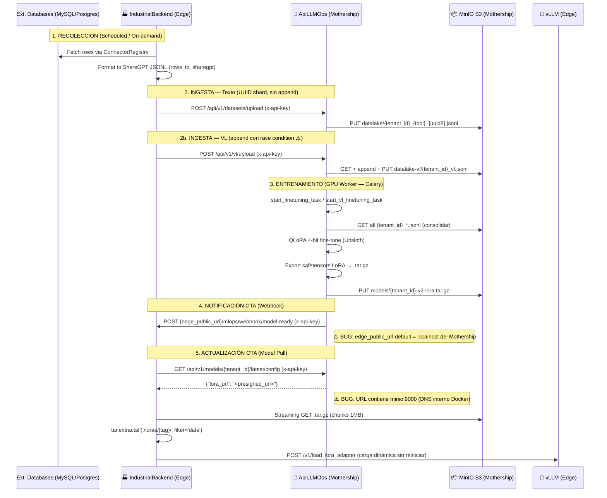

# 🛰️ Auditoría de Comunicación End-to-End: Edge <-> Mothership

> **Última revisión:** Abril 2026

Este reporte detalla el flujo completo de vida de los datos y modelos entre el nodo local (**IndustrialBackend**) y el hub central (**ApiLLMOps**).

---

## 1. Mapa de Comunicación de Alto Nivel



---

## 2. Fase A: Recolección y "Push" de Datos

### 2.1 Ejecución del Colector (`collector_service.py`)
El `CollectorService` en el Edge Node es el responsable de "alimentar" a la Mothership.
- **Trigger**: APScheduler (cron expresión configurable por fuente) o manual vía `POST /db-collector/sources/{id}/run`.
- **Lógica**:
    1. Obtiene la configuración de `DbSource` de BD (tipo de DB, query, credenciales encriptadas con Fernet).
    2. Desencripta la connection string y usa el `ConnectorRegistry` para ejecutar la query.
    3. **Delta slicing**: Usa `last_collected_at` como cursor para no re-enviar historial completo.
    4. **Curación Local**: Transforma filas en pares Instrucción/Respuesta con `rows_to_sharegpt`.
- **Output**: Archivo temporal en `/tmp/{tenant_id}_{source_name}.jsonl`.

### 2.2 Upload Seguro (`mothership_client.py`)
El Edge usa un cliente HTTP centralizado (`MothershipClient`) para hablar con la nube.
- **Autenticación**: Header `x-api-key: {settings.mothership_api_key}`.
- **Endpoint texto**: `POST /api/v1/datasets/upload` — multipart/form-data con `file` + `tenant_id`.
- **Nombre remoto texto**: `{tenant_id}_{tool_name}.jsonl` — partición independiente en MinIO.
- **Endpoint VL**: `POST /api/v1/vl/upload` — multipart con `file` + `tenant_id` + `tool_name`.
- **Timeout**: 60 segundos (puede ser insuficiente en redes industriales lentas con datasets grandes).

---

## 3. Fase B: Orquestación de Entrenamiento (Mothership)

### 3.1 Receiver & Data Lake

**Pipeline de Texto** (`datasets.py`):
- Genera nombre único: `{tenant_id}_{tool_name}_{uuid8}.jsonl`.
- Guarda en `/tmp/datalake/` y sube a bucket `datalake` como partición independiente.
- **No hay descarga ni reescritura del histórico** — patrón correcto y escalable.

**Pipeline VL** (`vl_datasets.py`):
- Descarga el objeto canónico `{tenant_id}_vl_{tool_name}.jsonl` de bucket `datalake-vl`.
- Hace append local del nuevo chunk y re-sube.
- **⚠️ Race condition**: dos uploads simultáneos del mismo tenant sobrescriben datos mutuamente.

### 3.2 GPU Training Pipeline

**Text Trainer** (`unsloth_trainer.py`, Celery task `start_finetuning_task`):
1. **Consolidación**: Lista todos los objetos del bucket `datalake` con prefijo `{tenant_id}_` y los descarga.
2. **HF Transfer**: `HF_HUB_ENABLE_HF_TRANSFER=1` para descarga acelerada de pesos base.
3. **QLoRA**: `FastLanguageModel.get_peft_model` con r=16, alpha=32, target_modules=all-linear.
4. `DataCollatorForCompletionOnlyLM`: penaliza loss solo sobre respuestas del assistant (SOTA).
5. **Export**: `model.save_pretrained(export_dir)` → safetensors → `tar.gz` → MinIO `models`.

**VL Trainer** (`vl_trainer.py`, Celery task `start_vl_finetuning_task`):
- Base model: `unsloth/Qwen2.5-VL-3B-Instruct-bnb-4bit`.
- `FastVisionModel` + `UnslothVisionDataCollator` (imágenes PIL + acciones JSON).
- `dataloader_num_workers=0` (PIL no serializable entre workers).
- Export idéntico: safetensors → `.tar.gz` → MinIO `models`.

---

## 4. Fase C: Actualización OTA (Over-The-Air)

### 4.1 El Webhook de Notificación
Una vez el modelo está en MinIO, el Celery Worker notifica al Edge:
- **Endpoint Edge**: `POST {webhook_url}/mlops/webhook/model-ready`.
- **Payload texto**: `{"model_tag": "{tenant_id}-v2", "model_type": "text"}`.
- **Payload VL**: `{"model_tag": "{tenant_id}-vl", "model_type": "vision"}`.
- **Seguridad**: Header `x-api-key: {settings.API_KEY}` — el Edge valida contra `settings.mothership_api_key`.
- **Validación Edge**: `model_tag` validado con regex `^[a-zA-Z0-9._:/\-]+$` antes de procesar.
- **Campo `mmproj_tag`**: Presente en el schema pero marcado como `Deprecated with vLLM`. Ignorado.

### 4.2 Descarga y Carga en vLLM (`mlops_service.py` / `vl_mlops_service.py`)

Procesado como `BackgroundTask` para no bloquear la respuesta HTTP del webhook:

1. **Registry Lookup**: `GET /api/v1/models/{tenant_id}/latest/config` (texto) o `/api/v1/vl/models/{tenant_id}/vl/config` (VL). Retorna `{"lora_url": "<presigned_url>"}`.
2. **Streaming Download**: Descarga el `.tar.gz` en chunks de 1MB a `/tmp/{model_tag}.tar.gz`.
3. **Extracción Segura**: `tar.extractall(path="./loras", filter="data")` — `filter='data'` previene path traversal (Python 3.12+).
4. **Carga Dinámica en vLLM**: `POST {vllm_host}/v1/load_lora_adapter` con:
   ```json
   {
     "lora_name": "{model_tag}",
     "lora_path": "/loras/{model_tag}",
     "load_inplace": true
   }
   ```
   `VLLM_ALLOW_RUNTIME_LORA_UPDATING=true` habilita actualización sin reinicio.
5. **Limpieza**: El `.tar.gz` temporal se borra en el bloque `finally`.

### 4.3 Gestión Multi-LoRA en vLLM (Edge)

vLLM permite servir **múltiples adaptadores LoRA simultáneamente** sobre un único modelo base en GPU — sin duplicar los pesos base (~2GB). La configuración del Edge define:

```
--max-loras 4          → VRAM reservada para 4 adaptadores simultáneos
--max-lora-rank 16     → techo de rango; debe coincidir con r=16 del training
--enable-lora          → activa el sistema LoRA de vLLM
```

**Slots activos post-OTA (2 de 4 disponibles):**

| Alias vLLM | Path físico | Quién lo carga |
|---|---|---|
| `aura_expert` | `/loras/aura_tenant_01-v2/` | `MLOpsService` (OTA texto) |
| `aura_system1` | `/loras/aura_tenant_01-vl/` | `VLMLOpsService` (OTA VL) |

**Selección del adaptador en cada request de inferencia:**
El `LLMFactory` del Edge crea el cliente con `model="aura_expert"` o `model="aura_system1"`. vLLM intercepta el nombre del modelo, localiza el LoRA registrado, y aplica los pesos delta sobre el base model en el forward pass. Ambos agentes comparten la misma GPU sin conflicto.

**Comportamiento de `load_inplace: true` en OTA:**
```
Sin load_inplace:   unload anterior → gap de servicio → load nuevo
Con load_inplace:   swap atómico en VRAM → zero-downtime ✓
```
Cuando el Mothership envía un nuevo modelo, el adaptador existente se actualiza en el slot sin liberar VRAM — las requests en vuelo con el modelo anterior terminan normalmente antes de que el nuevo tome efecto.

**Restricción de diseño:** El campo `--max-lora-rank 16` es un techo global del servidor vLLM. Si en el futuro el training usa `r=32` o `r=64`, el adaptador no cargará. El valor `r` en Unsloth y `--max-lora-rank` en vLLM deben mantenerse sincronizados entre ambos sistemas.

---

## 5. Análisis de Seguridad Cross-System

| Elemento | Mecanismo | Nivel de Riesgo |
|----------|-----------|-----------------|
| **Auth Edge → Mothership** | Header `x-api-key` (HTTPS) | Medio — rotación periódica necesaria |
| **Auth Mothership → Edge** | Header `x-api-key` en webhook | **Alto** — mismo secreto que Edge→Mothership |
| **Validación `model_tag`** | Regex `^[a-zA-Z0-9._:/\-]+$` en Edge | Bajo — bien implementado |
| **Extracción tar.gz** | `filter='data'` (Python 3.12+) | Bajo — path traversal prevenido |
| **Presigned URLs** | TTL 2 horas (MinIO firma S3) | Medio — hostname interno puede no resolver |
| **Credenciales DB Sources** | Fernet encryption (derivada de `secret_key`) | Medio — key reuse JWT + Fernet |
| **Defaults hardcodeados** | `"default-mothership-secret-key"` en ambos repos | **Alto** — secreto público si no se configura |
| **API key comparison** | `==` en lugar de `hmac.compare_digest` | Bajo — timing attack teórico |

---

## 6. Bugs Críticos en el Canal de Comunicación

> [!CAUTION]
> ### BUG 1: `trigger_training_job` no existe en MothershipClient
> El endpoint `POST /mlops/training/launch` llama a `mothership_client.trigger_training_job()` que no está implementado en `MothershipClient`. Lanza `AttributeError` en producción. El disparo manual de text training desde el Edge está completamente roto.
> **Fix**: Implementar el método en `mothership_client.py` apuntando a `POST /api/v1/training/job`.

> [!CAUTION]
> ### BUG 2: Presigned URL contiene hostname Docker interno (`minio:9000`)
> `MinioManager` se inicializa con `MINIO_ENDPOINT=minio:9000` (interno Docker). Las presigned URLs generadas contienen `http://minio:9000/...`. El Edge (fuera de la red Docker del Mothership) no puede resolver ese hostname — la descarga del `.tar.gz` falla. `MINIO_EXTERNAL_ENDPOINT` está en config pero nunca se usa en `storage.py`.
> **Fix**: Usar `MINIO_EXTERNAL_ENDPOINT` para generar presigned URLs (cliente MinIO separado).

> [!CAUTION]
> ### BUG 3: `edge_public_url` default apunta al propio Mothership
> `settings.edge_public_url = "http://localhost:8000"` en IndustrialBackend. Cuando ApiLLMOps (en Docker) envía el webhook a `http://localhost:8000`, ese `localhost` resuelve al propio contenedor Mothership, no al Edge. El webhook nunca llega.
> **Fix**: Requerir configuración explícita de `edge_public_url` en `.env` — eliminar default.

> [!WARNING]
> ### BUG 4: VL LoRA entrenado para base model incompatible con vLLM del Edge
> El VL trainer usa `Qwen2.5-VL-3B-Instruct-bnb-4bit` como base. El vLLM del Edge corre `Qwen/Qwen3.5-2B`. Son arquitecturas incompatibles — un LoRA entrenado sobre `Qwen2.5-VL-3B` no puede cargarse en `Qwen3.5-2B`. El pipeline VL completo falla silenciosamente en la fase de carga.
> **Fix**: Decisión de arquitectura — o el vLLM del Edge corre `Qwen2.5-VL-3B` como base, o el VL trainer usa `Qwen3.5-2B` (si tiene capacidades multimodales).

> [!WARNING]
> ### Sin idempotencia en webhook OTA — doble entrega corrompe `/loras/`
> Si el Mothership reintenta el webhook (timeout de red, bug), dos `BackgroundTask` se ejecutan concurrentemente, ambas escribiendo al mismo path `/tmp/{model_tag}.tar.gz` y extrayendo al mismo `./loras/{model_tag}/`. El resultado es corrupción silenciosa del adaptador. No hay mutex ni flag de "en progreso".
> **Fix**: Implementar flag de estado por `model_tag` antes de iniciar el proceso OTA.

> [!NOTE]
> ### Fragilidad del Name Mapping (`tenant_id`)
> La comunicación depende de que el `tenant_id` sea idéntico en ambos sistemas. Si se cambia en uno (`mlops_tenant_id` en Edge config), el webhook no coincidirá con el dataset del Mothership.
> **Recomendación**: Introducir un ID de suscripción UUID persistente por tenant.
