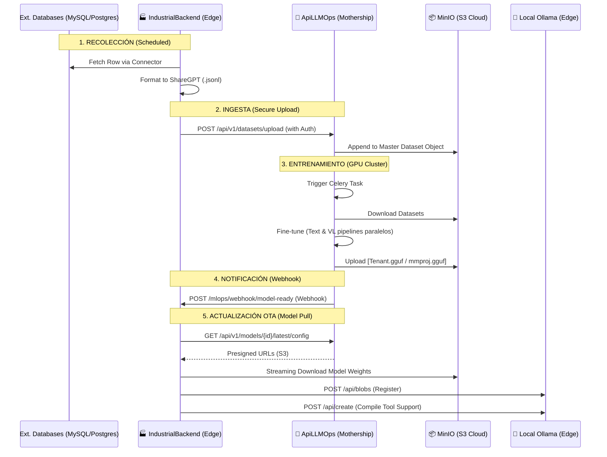

# 🛰️ Auditoría de Comunicación End-to-End: Edge <-> Mothership

Este reporte detalla el flujo completo de vida de los datos y modelos entre el nodo local (**IndustrialBackend**) y el hub central (**ApiLLMOps**).

---

## 1. Mapa de Comunicación de Alto Nivel

---

## 2. Fase A: Recolección y "Push" de Datos

### 2.1 Ejecución del Colector (`collector_service.py`)
El `CollectorService` en el Edge Node es el responsable de "alimentar" a la Mothership.
- **Trigger**: Ocurre vía Scheduler (cron diario) o manual vía UI.
- **Logic**:
    1. Obtiene la configuración de `DbSource` (tipo de DB, query, credenciales encriptadas).
    2. Usa el `ConnectorRegistry` para despachar la query asincrónicamente.
    3. **Curación Local**: Transforma las filas crudas en pares Instrucción/Respuesta usando `rows_to_sharegpt` para que el LLM aprenda de la data industrial real.
- **Persistence**: Crea un archivo temporal en `/tmp/{tenant_id}_{source_name}.jsonl`.

### 2.2 Upload Seguro (`mothership_client.py`)
El Edge usa un cliente HTTP centralizado (`mothership_client`) para hablar con la nube.
- **Protocolo**: HTTPS.
- **Autenticación**: Cabecera `x-api-key: {settings.MOTHERSHIP_API_KEY}`.
- **Endpoint**: `ApiLLMOps: /api/v1/datasets/upload`.

---

## 3. Fase B: Orquestación de Entrenamiento (Mothership)

### 3.1 Receiver & Data Lake (`datasets.py`)
ApiLLMOps recibe los `.jsonl`.
- **Atomicidad**: Por cada subida, la Mothership descarga el objeto maestro de MinIO, le concatena la nueva data, y lo re-sube. 
- **Estructura S3**: Organizado por `bucket: datalake` y `prefix: {tenant_id}_`.

### 3.2 GPU Training Pipeline (`unsloth_trainer.py`)
Cuando un "Job" es disparado:
1. **Consolidación**: El Worker Celery descarga TODOS los archivos que coincidan con el tenant.
2. **Transferencia Acelerada**: Se activa `HF_HUB_ENABLE_HF_TRANSFER=1` para velocidad máxima de descarga de pesos base.
3. **Optimización Blackwell**: Unsloth inyecta adaptadores LoRA (r=16) en todos los módulos lineales del modelo.
4. **Quantization On-the-fly**: Al terminar, el worker ejecuta una conversión a `GGUF (Q4_K_M)` compatible con los recursos limitados del Edge Node.

---

## 4. Fase C: Actualización OTA (Over-The-Air)

### 4.1 El Disparo Ruteado (Webhook)
Una vez el modelo está en S3, la Mothership llama al Edge:
- **Endpoint**: `IndustrialBackend: /api/v1/mlops/webhook/model-ready`.
- **Payload**: `{"model_tag": "aura...", "model_type": "text | vision", "mmproj_tag": "..."}`.
- **Seguridad**: El Edge valida que el API Key del webhook coincida con su secreto. El `model_type` define qué Service lo gestiona.

### 4.2 Descarga y Registro Local (`mlops_service.py`)
Este es el paso más sofisticado del Edge Node.
1. **Model Discovery**: Llama a la Mothership para solicitar URLs de descarga.
2. **Presigned URLs**: ApiLLMOps genera links temporales (firma S3) para que el Edge le pida los GBs de datos directamente a MinIO, no a la aplicación API (más eficiente).
3. **Streaming Download**: El Edge descarga el `.gguf` en trozos de 1MB para no saturar su propia RAM.
4. **Ollama Ingestion Dual**: 
    - Calcula el **SHA256** del archivo descargado.
    - Sube los blobs a la API de Ollama (`/api/blobs/{digest}`).
    - Crea el modelo (`/api/create`): Para modelos Visuales, emplea un `Modelfile` con la estructura `FROM <hash>` + `ADAPTER <hash_mmproj>` para enlazar el proyector visual.

---

## 5. Análisis de Seguridad Cross-System

| Elemento | Mecanismo | Nivel de Riesgo |
|----------|-----------|-----------------|
| **Data in Transit** | TLS 1.3 (HTTPS) obligatorio | Bajo |
| **Auth Edge -> Hub** | `x-api-key` compartida | Medio (Requiere rotación) |
| **Auth Hub -> Edge** | Webhook Security Protocol (API Key) | Medio |
| **Model Weights** | Presigned URLs con TTL (Time-To-Live) | Muy bajo (URL expira en 2h) |
| **Data in Rest** | MinIO Encryption + PG Encryption | Bajo |

---

## 6. Observaciones Críticas de Comunicación

> [!WARNING]
> ### Riesgo de "Inundación" en MinIO
> Actualmente el `IndustrialBackend` envía archivos JSONL completos en cada `upload`. Si el Edge tiene una base de datos muy grande y vuelve a subir el historial completo + 1 fila nueva, el tráfico de red crecerá exponencialmente. 
> **Recomendación**: Implementar un puntero de "Last Row ID" en `CollectorService` para enviar solo delta-updates (incremental data push).

> [!CAUTION]
> ### Fragilidad del Name Mapping
> La comunicación depende de que el `tenant_id` sea idéntico en ambos sistemas. Si se cambia en uno y no en el otro, el Webhook será ignorado por el Edge o el Hub no encontrará los datasets.
> **Recomendación**: Introducir un ID de suscripción UUID que no dependa de nombres legibles.

> [!IMPORTANT]
> ### DNS en Docker
> La Mothership utiliza `host.docker.internal` en su configuración de Webhook por defecto. Esto funciona en desarrollo local pero fallará catastróficamente en un despliegue distribuido de producción.
> **Recomendación**: Configurar `MOTHERSHIP_WEBHOOK_OVERRIDE` en el ambiente de producción para apuntar a la IP/Dominio real del Nodo Edge.
