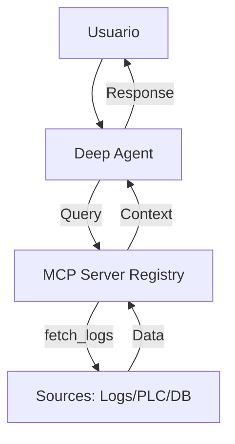
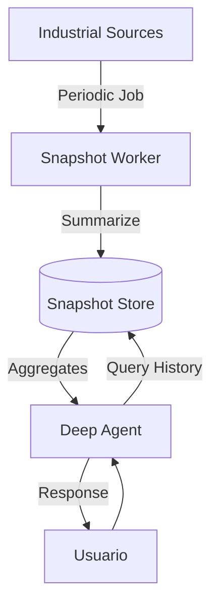

# IA Industrial Backend (Edge AI + RAG)

Backend para analisis industrial con agente LLM, RAG para documentos y base para edge AI. El objetivo es operar en tiempo real con datos vivos (hot path) y mantener conocimiento historico con adapters LoRA por empresa/fuente/periodo (cold path), sin depender de RAG pesado para datos numericos.

## Estado actual (codigo)

### Componentes principales
- **API**: FastAPI con endpoints de auth, usuarios, conversaciones, documentos, chat, prompts, modelos y admin.
- **LLM**: LLMFactory con proveedores Ollama y OpenRouter.
- **Agente**: DeepAgents + LangGraph con herramienta `ask_knowledge_agent` para RAG.
- **Persistencia**:
  - Postgres: usuarios, conversaciones, prompts, modelos y settings.
  - Qdrant: embeddings de documentos.
  - MinIO: archivos originales.
  - Postgres (LangGraph): checkpointer y store.

### Flujo actual de documentos (RAG)
1. `POST /documents/upload` guarda el archivo en MinIO.
2. `DocumentProcessor` carga el archivo, hace split y embeddings.
3. Los embeddings se guardan en Qdrant con metadata.
4. `ask_knowledge_agent` consulta Qdrant por `user_id` y `knowledge_base_id`.

### Flujo actual de chat
1. `POST /chat/chat` crea o reutiliza conversacion.
2. `AgentService` resuelve modelo y parametros.
3. DeepAgent llama a `ask_knowledge_agent` si hay Knowledge Base activa.
4. Se persiste el mensaje en Postgres.

### Docker (servicios actuales)
- `minio`, `qdrant`, `postgres`, `ollama`, `api`.


## Vision del sistema (MCP + Dynamic Insights)

### Objetivo
- **Hot path (MCP)**: Acceso dinámico a datos vivos (logs, métricas de sensores) bajo demanda mediante herramientas MCP. Sin ingesta masiva innecesaria.
- **Cold path (Snapshots)**: Resúmenes compactos (snapshots) diarios/semanales almacenados en Postgres para análisis histórico de tendencias.
- **RAG**: Reservado para conocimiento textual estático (manuales, normativas).

### Principios
- **Conectividad bajo demanda**: El agente activa herramientas MCP cuando necesita datos específicos.
- **Memoria compacta**: En lugar de millones de filas crudas, guardamos "conocimiento comprimido" del pasado.
- **Tokens eficientes**: Solo se pasan al LLM los fragmentos de logs o resúmenes de snapshots relevantes a la consulta.


## Arquitectura de Datos

### 1) Herramientas MCP (Hot Path)
El agente utiliza servidores MCP para conectar con:
- **Logs de Sistema**: Consulta de errores y trazas en tiempo real.
- **Métricas PLC/SCADA**: Lectura puntual de registros de maquinaria.
- **APIs Externas**: Datos de manufactura o energía bajo demanda.

### 2) Cold Path: Snapshot Store & Pipeline
El sistema no solo guarda datos, sino que genera **conocimiento histórico** mediante trabajadores en segundo plano (Celery + Redis):

**Flujo del Pipeline:**
1. **Recolección**: Un worker de Celery extrae datos crudos (logs o métricas) de las fuentes vía MCP o query.
2. **Agregación Matemática**: Se calculan promedios, picos, desviaciones y conteo de eventos de forma algorítmica.
3. **Enriquecimiento Semántico**: Se envía un "resumen numérico" al LLM (Ollama) con un prompt especializado para detectar patrones industriales ("se observa un drift ascendente en temperatura").
4. **Persistencia**: El resultado se guarda en Postgres como un snapshot estructurado:

```json
{
  "timestamp": "2024-03-16",
  "asset_id": "linea_ensamblaje_01",
  "summary": {
    "math_stats": {"avg_temp": 45.2, "max_vibration": 0.8},
    "ai_insight": "Operación estable con leves micro-paradas en la mañana.",
    "events": ["sensor_spike_08:15", "maintenance_stop_14:00"]
  },
  "anomaly_score": 0.05
}
```

## Diagrama de Flujo (Propuesto)

### Hot Path (Consulta Dinámica)


### Cold Path (Historical Snapshots)


## Plan paso a paso (Nuevo Roadmap)

### A) Implementación MCP
1. **MCP Manager**: Crear el gestor de conexiones a servidores MCP en el backend.
2. **Standard Tools**: Definir esquemas para herramientas de lectura de logs y métricas.
3. **Registry**: Registrar servidores MCP locales/remotos.

### B) Sistema de Snapshots
1. **Worker Service**: Implementar tareas periódicas para recolectar datos "en frío".
2. **Storage**: Definir la tabla de `Snapshots` en Postgres.
3. **Retrieval**: Crear la herramienta para que el agente consulte el histórico compacto.


## Comportamiento del LLM (casos de uso)

### Caso 1: Consulta en Tiempo Real (Logs/Sensores)
- El usuario pregunta: "¿Qué error hubo en la línea 1 hace 10 minutos?"
- El Agente activa la herramienta MCP `fetch_logs`.
- El LLM analiza los logs obtenidos y responde.

### Caso 2: Análisis de Tendencia Histórica
- El usuario pregunta: "¿Cómo ha sido la eficiencia de esta semana?"
- El Agente consulta el `Snapshot Store` en Postgres.
- El LLM recibe los resúmenes diarios y genera un reporte de tendencia.

### Caso 3: Documento + Datos Vivos
- `ask_knowledge_agent` consulta RAG (Qdrant) por normativas.
- En paralelo, el MCP trae el estado actual de la máquina.
- LLM responde: "Según la normativa X, la vibración actual es excesiva..."


## Modelos con Ollama (Edge AI)

### Modelo Base
- Se utiliza un modelo potente y eficiente como `qwen3.5:9b` o `llama3.1:8b`.
- Configuración vía `Modelfile` para incluir instrucciones de seguridad industrial.

### Futuro: Adapters LoRA
- Aunque el hot/cold path se maneja vía MCP/Snapshots, se pueden usar LoRA para "estilos de razonamiento" específicos por planta, sin necesidad de entrenar con datos numéricos crudos.


## Buenas practicas (MCP + Snapshots)

### Hot path (Consulta MCP)
- No traer volúmenes masivos de datos crudos al LLM.
- Usar filtros de tiempo y asset_id específicos en la herramienta MCP.
- Incluir metadatos claros en la respuesta del MCP para que el LLM sepa qué está mirando.

### Cold path (Snapshots)
- Generar snapshots en horas de baja carga.
- Mantener los snapshots en formato JSON estructurado para facilitar el filtrado en Postgres.
- Incluir un `anomaly_score` o `summary_text` ya pre-procesado para ahorrar tokens.

### Versionado y Seguridad
- Controlar el acceso a los servidores MCP mediante tokens.
- Auditar las consultas del agente a fuentes industriales sensibles.


## API (resumen)
- `POST /auth/login`
- `POST /auth/register`
- `GET /users/me`
- `POST /documents/upload`
- `GET /documents/{doc_id}`
- `POST /chat/chat`
- `POST /chat/chat/stream`
- `GET /knowledge/*`
- `GET /admin/*`


## Configuracion
Requiere `.env` con:
- `QDRANT_HOST`, `QDRANT_PORT`, `QDRANT_COLLECTION`, `EMBEDDING_MODEL`
- `MINIO_ENDPOINT`, `MINIO_ACCESS_KEY`, `MINIO_SECRET_KEY`, `MINIO_BUCKET`
- `POSTGRES_*`
- `SECRET_KEY`
- `OLLAMA_BASE_URL`, `OPENROUTER_*`


## Nota importante
Este README refleja el estado real del codigo y el roadmap acordado para edge AI.
El pipeline asinc con Celery/Redis y el NER avanzado no estan activos en el codigo actual.
