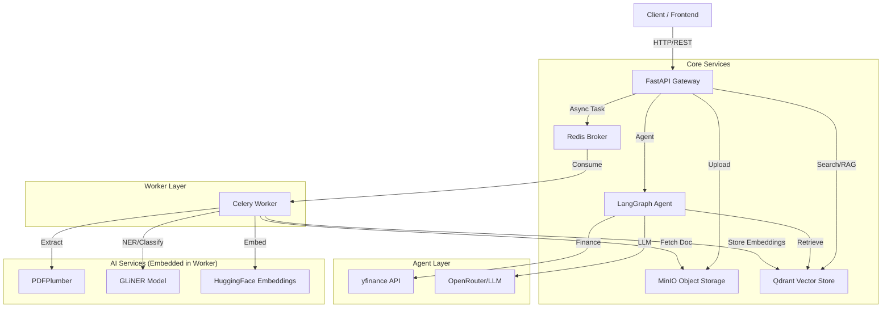

# Technical Report - Scalable Document Analysis System

## 1. System Architecture

### 1.1 High-Level Architecture
The system follows a **Microservices Event-Driven Architecture** designed for scalability and fault tolerance.



### 1.2 Docker Services Overview
The system is composed of the following containerized services defined in `docker-compose.yml`:

| Service | Role | Description |
| :--- | :--- | :--- |
| **api** | Gateway | FastAPI application handling HTTP requests, validation, and task dispatching. |
| **worker** | Processing | Celery worker that executes heavy background tasks (PDF parsing, AI inference). |
| **redis** | Broker | Message broker for Celery task queues and result backend. |
| **minio** | Storage | S3-compatible object storage for raw document files (PDF, DOCX). |
| **qdrant** | Vector DB | Vector database for storing document embeddings and metadata for semantic search. |
| **flower** | Monitoring | Web UI for monitoring Celery workers and task progress (Port 5555). |
| **cadvisor** | Metrics | Google's cAdvisor for monitoring container resource usage (CPU/RAM). |

### 1.3 Project Structure
The codebase is organized to separate concerns and promote modularity:

```
aura-core-ai-test/
├── app/                        # Core application source code
│   ├── api/                    # API Layer
│   │   ├── endpoints/          # Route handlers (documents, search, system)
│   │   └── router.py           # Main API router configuration
│   ├── agent/                  # Agentic AI Layer
│   │   ├── finance/            # Finance Subgraph
│   │   │   ├── graph.py        # Subgraph definition
│   │   │   ├── nodes.py        # Subgraph nodes (LLM, Tools)
│   │   │   └── state.py        # Subgraph state definition
│   │   ├── nodes.py            # Main agent nodes
│   │   ├── state.py            # Main agent state
│   │   ├── tools.py            # Agent tools (RAG, Finance)
│   │   └── workflow.py         # Main agent workflow definition
│   ├── core/                   # Core infrastructure
│   │   ├── config.py           # Environment configuration (Pydantic settings)
│   │   └── vector_store.py     # Qdrant client wrapper
│   ├── ingestion/              # Document Processing Pipeline
│   │   ├── document_loader.py  # PDF/DOCX parsing logic
│   │   ├── pipeline.py         # Main processing orchestration
│   │   └── text_splitter.py    # Intelligent text chunking
│   ├── models/                 # AI/ML Models
│   │   └── ner.py              # GLiNER wrapper for NER and Classification
│   ├── retrieval/              # Search & RAG Logic
│   │   ├── rag.py              # RAG chain implementation
│   │   └── searcher.py         # Semantic search logic
│   ├── services/               # Business Logic Layer
│   │   └── document_service.py # Coordinator for uploads and document management
│   ├── storage/                # Storage Clients
│   │   └── minio_client.py     # MinIO wrapper
│   ├── main.py                 # FastAPI application entry point
│   └── tasks.py                # Celery task definitions
├── data/                       # Persistent data storage (mapped to Docker volumes)
├── docs/                       # Project documentation
├── test/                       # Unit and integration tests
├── Dockerfile                  # Multi-stage Docker build definition
├── docker-compose.yml          # Local development environment orchestration
└── requirements.txt            # Python dependencies
```

### 1.4 Configuration
The application relies on environment variables for configuration. A `.env` file must be present in the root directory for the system to function correctly. This file defines connection strings, credentials, and model parameters.

**Required Environment Variables:**

| Category | Variable | Description |
| :--- | :--- | :--- |
| **Qdrant** | `QDRANT_HOST` | Hostname of the Qdrant service (e.g., `qdrant`). |
| | `QDRANT_PORT` | Port for Qdrant API (e.g., `6333`). |
| | `QDRANT_COLLECTION` | Name of the vector collection. |
| | `EMBEDDING_MODEL` | Name of the embedding model to use. |
| **OpenRouter** | `OPENROUTER_API_KEY` | API Key for OpenRouter (LLM access). |
| | `OPENROUTER_MODEL` | Model ID to use (e.g., `openai/gpt-4o`). |
| **Celery** | `CELERY_BROKER_URL` | Redis connection string for the broker. |
| | `CELERY_RESULT_BACKEND` | Redis connection string for results. |
| **MinIO** | `MINIO_ENDPOINT` | Hostname/IP of the MinIO service. |
| | `MINIO_ACCESS_KEY` | Access key (username) for MinIO. |
| | `MINIO_SECRET_KEY` | Secret key (password) for MinIO. |
| | `MINIO_BUCKET` | Name of the bucket to store documents. |
| | `MINIO_SECURE` | Boolean (`true`/`false`) for SSL/TLS. |

### 1.4.1 Example Configuration

```bash
# Qdrant
QDRANT_HOST=qdrant
QDRANT_PORT=6333
QDRANT_COLLECTION=documents
EMBEDDING_MODEL=sentence-transformers/all-MiniLM-L6-v2

# OpenRouter
OPENROUTER_API_KEY=sk-or-v1-...
OPENROUTER_MODEL=openai/gpt-4o

# Celery
CELERY_BROKER_URL=redis://redis:6379/0
CELERY_RESULT_BACKEND=redis://redis:6379/0

# MinIO
MINIO_ENDPOINT=minio:9000
MINIO_ACCESS_KEY=minioadmin
MINIO_SECRET_KEY=minioadmin
MINIO_BUCKET=aura-docs
MINIO_SECURE=false
```

### 1.5 Sample Data
The `data/samples` directory contains example files that can be used to test the system's ingestion and processing capabilities:

- **`DatosFinancieros.pdf`**: A sample financial document to test table extraction and financial entity recognition.
- **`contrato.pdf`**: A sample legal contract to test classification and entity extraction in a legal context.
- **`DataPrueba.json`**: A JSON file containing sample data for testing purposes.

## 2. API Endpoints

The API is organized into three main modules:

### 2.1 Documents (`/documents`)
- **POST `/upload`**: Uploads a file (PDF/DOCX/JSON). It saves the file to MinIO and triggers an asynchronous processing task. Returns a `task_id`.
- **GET `/status/{task_id}`**: Checks the progress of a processing task (e.g., "processing", "completed").
- **GET `/documents/{doc_id}`**: Retrieves details of a processed document, including its classification, extracted entities, and metadata.
- **DELETE `/documents/{doc_id}`**: Removes a document and its associated vector embeddings from the system.

### 2.2 Search & RAG (`/search`, `/chat`)
- **GET `/search`**: Performs semantic search on the document collection. Supports filtering by:
    - `q`: Query text.
    - `entity_filter`: Filter by presence of specific entities (e.g., "money").
    - `category_filter`: Filter by document type (e.g., "contract").
- **POST `/chat`**: RAG (Retrieval-Augmented Generation) endpoint. Accepts a natural language question, retrieves relevant context from Qdrant, and generates an answer using the LLM (OpenRouter).

### 2.3 Finance Agent (Subgraph)
The system includes a specialized **Finance Agent** integrated into the main LangGraph workflow.

- **Functionality:**
    - **Natural Language Processing:** Uses an LLM node to analyze user queries and extract stock ticker symbols (e.g., "AAPL" from "What is the price of Apple?").
    - **Data Retrieval:** Fetches real-time stock market data (price, market cap, currency, etc.) using the `yfinance` library.
    - **Integration:** Acts as a tool within the main agent, allowing the orchestrator to dynamically switch between document retrieval (RAG) and external financial data based on the user's intent.

- **Technologies:**
    - **LangGraph:** For orchestrating the stateful agent workflow and subgraphs.
    - **yfinance:** For accessing open stock market data.
    - **OpenRouter/OpenAI:** For the LLM reasoning capabilities.

### 2.3 System (`/health`)
- **GET `/health`**: Simple health check to verify the API is running and responsive.

## 3. Document Processing Pipeline

The document processing flow is designed to be robust and asynchronous:

1.  **Ingestion (API):**
    - User uploads a file via `POST /upload`.
    - API saves the raw file to **MinIO**.
    - API pushes a `process_document` task to **Redis**.
    - API returns a `task_id` immediately (non-blocking).

2.  **Processing (Worker):**
    - **Celery Worker** picks up the task from Redis.
    - **Download:** Worker downloads the file from MinIO to local temporary storage.
    - **Loading:** `DocumentLoader` parses the file.
        - *PDFs:* Uses `pdfplumber` to extract text and **tables** (converted to Markdown).
    - **Classification:** The full text is passed to **GLiNER** to classify the document type (e.g., "invoice", "contract").
    - **Splitting:** `HierarchicalSplitter` chunks the text, respecting document headers/sections.
    - **Enrichment (NER):** Each chunk is processed by **GLiNER** to extract entities (Persons, Dates, Money, etc.).
    - **Embedding:** Chunks are converted to vectors using **HuggingFace Embeddings**.
    - **Indexing:** Vectors + Metadata (Entities, Category, Source) are upserted to **Qdrant**.

3.  **Completion:**
    - Worker updates task status to "SUCCESS".
    - Temporary files are cleaned up.

## 4. Model Selection Justification

### 4.1 Named Entity Recognition (NER) & Classification
**Selected Model:** `fastino/gliner2-base-v1` (GLiNER)

**Justification:**
- **Zero-Shot Capabilities:** Unlike traditional BERT-based NER models that require training on specific labels, GLiNER allows us to define arbitrary entity types (e.g., "financial_metric", "fiscal_period") at runtime without retraining.
- **Performance/Size Balance:** The "base" version offers an excellent trade-off between inference speed and accuracy, suitable for CPU inference in cost-effective workers.
- **Unified Architecture:** We use the same model instance for both Entity Extraction and Document Classification, reducing memory footprint.

### 4.2 Embeddings
**Selected Model:** `sentence-transformers/all-MiniLM-L6-v2`

**Justification:**
- **Efficiency:** This is a lightweight model optimized for speed and low memory usage, making it ideal for local execution in a containerized environment.
- **Flexibility:** The system is designed to be model-agnostic; other HuggingFace models can be easily swapped in by updating the configuration if higher accuracy or different language support is needed.
- **Local Execution:** Runs entirely locally, ensuring data privacy and zero latency from external API calls.
- **Compatibility:** Fully compatible with Qdrant's cosine distance metric.

## 5. Scalability & Performance

### 5.1 Horizontal Scaling
- **Stateless API:** The FastAPI layer is stateless. We can scale it horizontally (add more replicas) behind a Load Balancer to handle increased HTTP traffic.
- **Decoupled Workers:** The heavy lifting (PDF parsing, Inference) happens in Celery workers. We can scale the number of worker containers independently based on queue depth (Redis) and CPU utilization.

### 5.2 Database Scaling
- **Qdrant:** Supports distributed deployment with sharding. As the vector index grows, we can add more Qdrant nodes.
- **MinIO/S3:** Object storage is inherently scalable for massive amounts of document data.
