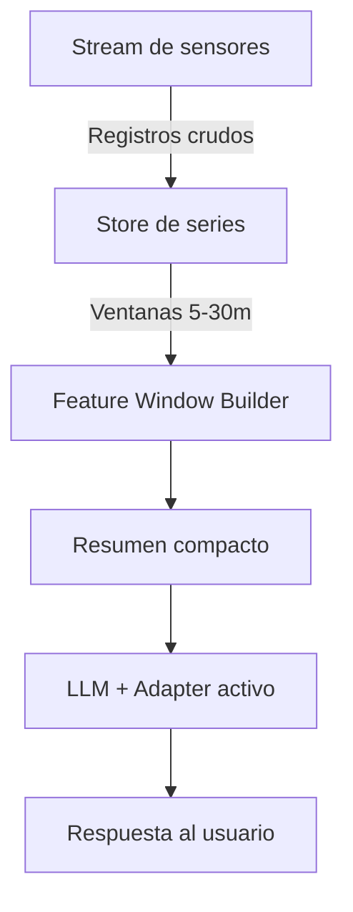
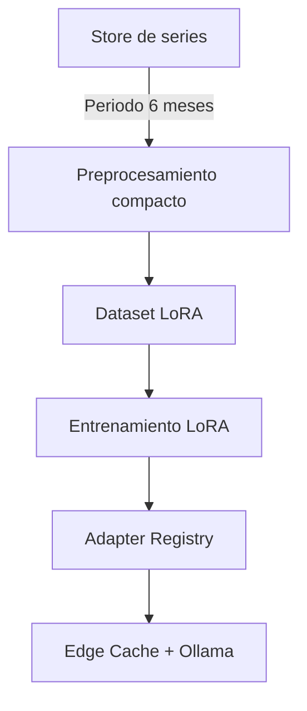
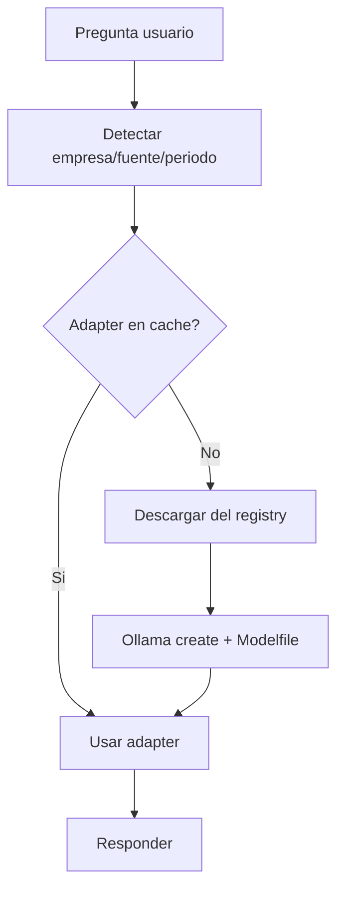
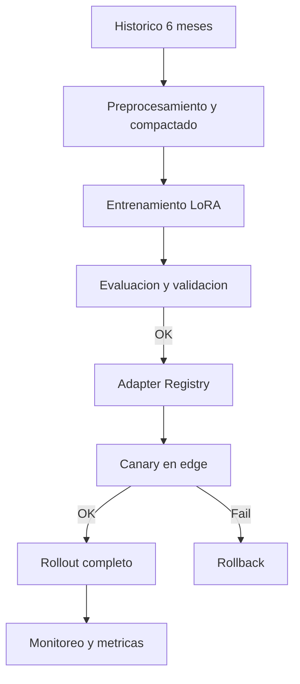

# IA Industrial Backend (Edge AI + RAG)

Backend para analisis industrial con agente LLM, RAG para documentos y base para edge AI. El objetivo es operar en tiempo real con datos vivos (hot path) y mantener conocimiento historico con adapters LoRA por empresa/fuente/periodo (cold path), sin depender de RAG pesado para datos numericos.

## Estado actual (codigo)

### Componentes principales
- **API**: FastAPI con endpoints de auth, usuarios, conversaciones, documentos, chat, prompts, modelos y admin.
- **LLM**: LLMFactory con proveedores Ollama y OpenRouter.
- **Agente**: DeepAgents + LangGraph con herramienta `ask_knowledge_agent` para RAG.
- **Persistencia**:
  - Postgres: usuarios, conversaciones, prompts, modelos y settings.
  - Qdrant: embeddings de documentos.
  - MinIO: archivos originales.
  - Postgres (LangGraph): checkpointer y store.

### Flujo actual de documentos (RAG)
1. `POST /documents/upload` guarda el archivo en MinIO.
2. `DocumentProcessor` carga el archivo, hace split y embeddings.
3. Los embeddings se guardan en Qdrant con metadata.
4. `ask_knowledge_agent` consulta Qdrant por `user_id` y `knowledge_base_id`.

### Flujo actual de chat
1. `POST /chat/chat` crea o reutiliza conversacion.
2. `AgentService` resuelve modelo y parametros.
3. DeepAgent llama a `ask_knowledge_agent` si hay Knowledge Base activa.
4. Se persiste el mensaje en Postgres.

### Docker (servicios actuales)
- `minio`, `qdrant`, `postgres`, `ollama`, `api`.


## Vision del sistema (real world)

### Objetivo
- **Hot path**: datos vivos en tiempo real con baja latencia.
- **Cold path**: datos historicos consolidados con LoRA por empresa/fuente/periodo.
- **RAG**: solo para documentos y texto, no para series numericas crudas.

### Principios
- **Escalable entre industrias**: por tipo de dato, no por industria.
- **Adapters por fuente**: cada fuente se normaliza a un schema canonico.
- **Adapters LoRA por periodo**: versionado semestral y rollback.
- **Minimo de tokens**: pasar resúmenes compactos (features) al LLM.


## TSDB (Time-Series Database)

Los registros crudos de sensores deben guardarse en un **TSDB** (Time-Series DataBase). Esto permite:
- Consultas por rango de tiempo de forma eficiente.
- Agregaciones rapidas (semanales/mensuales) para el entrenamiento.
- Escalabilidad para millones de registros.

Ejemplos: TimescaleDB, InfluxDB.


## Diseno propuesto (Roadmap)

### 1) Data Adapters (por fuente)
Normalizan cualquier fuente al schema canonico:
```
empresa, source_type, asset_id, timestamp, metrics, events
```
Ejemplo `source_type`: `manufactura_linea`, `maquinaria_pesada`, `energia`, `calidad`.

### 2) Streaming -> Registros -> Ventanas
- El streaming llega como registros crudos (time series).
- Se almacenan como **registros** en el TSDB.
- Cada ventana (5-30 min) genera **resúmenes compactos** para analisis.

### 3) Feature Window Builder
Convierte series numericas en resúmenes compactos:
- Promedios, std, min, max, p95, tendencia
- Eventos: `spike`, `drift_up`, `shutdown`, `out_of_range`

### 4) Historical Compact Store (sin RAG pesado)
Agregados por maquina/periodo:
- Mensual o semanal
- KPIs y conteos de eventos
- Consultable con pocas filas

### 5) LoRA por empresa/fuente/periodo
Id sugerido:
```
{empresa}:{source_type}:{YYYY-H1/H2}
```
El adapter aprende patrones y estilo de analisis, no datos exactos.

### 6) Adapter Registry + Router
- Seleccion dinamica del adapter segun `empresa`, `source_type` y rango temporal.
- Cache local en edge + descarga bajo demanda.
- Canary y rollback.


## Diagrama Hot Path (datos vivos)


```mermaid
graph TD
    Stream[Stream de sensores] -->|Registros crudos| TSDB[Store de series]
    TSDB -->|Ventanas 5-30m| Window[Feature Window Builder]
    Window --> Compact[Resumen compacto]
    Compact --> LLM[LLM + Adapter activo]
    LLM --> Resp[Respuesta al usuario]
```

## Diagrama Cold Path (entrenamiento)


```mermaid
graph TD
    TSDB2[Store de series] -->|Periodo 6 meses| Prep[Preprocesamiento compacto]
    Prep --> Dataset[Dataset LoRA]
    Dataset --> Train[Entrenamiento LoRA]
    Train --> Registry[Adapter Registry]
    Registry --> Edge[Edge Cache + Ollama]
```

## Diagrama Router (seleccion de adapters)


```mermaid
graph TD
    Q[Pregunta usuario] --> Detect[Detectar empresa/fuente/periodo]
    Detect --> Cache{Adapter en cache?}
    Cache -->|Si| Use[Usar adapter]
    Cache -->|No| Pull[Descargar del registry]
    Pull --> Create[Ollama create + Modelfile]
    Create --> Use
    Use --> LLM2[Responder]
```

## Diagrama CI/CD de Adapters


```mermaid
graph TD
    Hist[Historico 6 meses] --> Prep2[Preprocesamiento y compactado]
    Prep2 --> Train2[Entrenamiento LoRA]
    Train2 --> Eval[Evaluacion y validacion]
    Eval -->|OK| Registry2[Adapter Registry]
    Registry2 --> Canary[Canary en edge]
    Canary -->|OK| Rollout[Rollout completo]
    Canary -->|Fail| Rollback[Rollback]
    Rollout --> Monitor[Monitoreo y metricas]
```


## Plan paso a paso (end-to-end)

### A) Ingesta en vivo (hot path)
1. **Ingesta streaming**: registros numericos llegan a un endpoint de stream.
2. **TSDB**: se guardan como registros crudos (time series).
3. **Ventanas**: cada 5-30 min se calculan features compactas.
4. **Resumen**: el LLM recibe solo el resumen (no la serie cruda).

### B) Entrenamiento semestral (cold path)
1. **Seleccion de periodo**: ultimos 6 meses por empresa/fuente.
2. **Preprocesamiento**: se compacta el historico en ventanas y eventos.
3. **Dataset LoRA**: se generan pares (resumen + pregunta) -> (analisis).
4. **Entrenamiento**: se entrena el adapter LoRA.
5. **Registro**: se publica en el Adapter Registry.

### C) Despliegue al edge
1. **Descarga**: el edge obtiene el adapter segun necesidad.
2. **Ollama**: se crea un modelo con `Modelfile` + `ADAPTER`.
3. **Cache**: se guardan las ultimas N versiones.
4. **Activacion**: router usa el adapter correcto.


## Comportamiento del LLM (casos de uso)

### Caso 1: Consulta reciente (< 6 meses)
- Router detecta rango reciente.
- Usa adapter activo del semestre actual.
- LLM recibe resumen vivo de la ventana.

### Caso 2: Consulta historica (> 6 meses)
- Router detecta periodo historico.
- Selecciona adapter del periodo (ej. 2024-H1).
- Si no esta en cache, se descarga y se carga.
- LLM recibe resumen historico compacto.

### Caso 3: Documento + datos
- `ask_knowledge_agent` consulta Qdrant.
- En paralelo, se agrega resumen numerico.
- LLM responde con ambos contextos.


## Actualizacion de modelos con Ollama (practico)

### Modelo base
- Ollama mantiene el **modelo base** (ej. `qwen3.5:9b`).
- Actualizacion tipica:
```
ollama pull qwen3.5:9b
```

### Adapters LoRA
- Los LoRA se generan en el core y se publican en un **Model Registry**.
- El edge descarga el adapter correcto y lo activa segun el router.
- Mantener ultimas 3-4 versiones por fuente/periodo.

> Nota: el codigo actual no carga LoRA aun. Esto entra en el roadmap.


## Buenas practicas (hot path + cold path)

### Hot path (tiempo real)
- Nunca pasar series crudas al LLM.
- Generar resúmenes de ventana (features) y eventos.
- Enviar al LLM solo el contexto minimo.

### Cold path (historico)
- Usar agregados compactos (no RAG pesado).
- El adapter LoRA aporta patrones y razonamiento.
- Para datos exactos: agregar resumen historico en pocas filas.

### Versionado
- Semestral (H1/H2) o rolling.
- Canary antes de produccion.
- Registro de performance por planta/linea.


## API (resumen)
- `POST /auth/login`
- `POST /auth/register`
- `GET /users/me`
- `POST /documents/upload`
- `GET /documents/{doc_id}`
- `POST /chat/chat`
- `POST /chat/chat/stream`
- `GET /knowledge/*`
- `GET /admin/*`


## Configuracion
Requiere `.env` con:
- `QDRANT_HOST`, `QDRANT_PORT`, `QDRANT_COLLECTION`, `EMBEDDING_MODEL`
- `MINIO_ENDPOINT`, `MINIO_ACCESS_KEY`, `MINIO_SECRET_KEY`, `MINIO_BUCKET`
- `POSTGRES_*`
- `SECRET_KEY`
- `OLLAMA_BASE_URL`, `OPENROUTER_*`


## Nota importante
Este README refleja el estado real del codigo y el roadmap acordado para edge AI.
El pipeline asinc con Celery/Redis y el NER avanzado no estan activos en el codigo actual.
